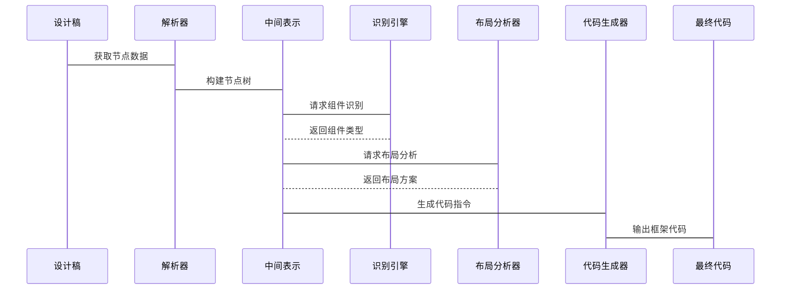
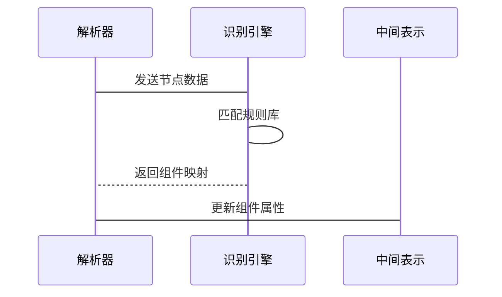
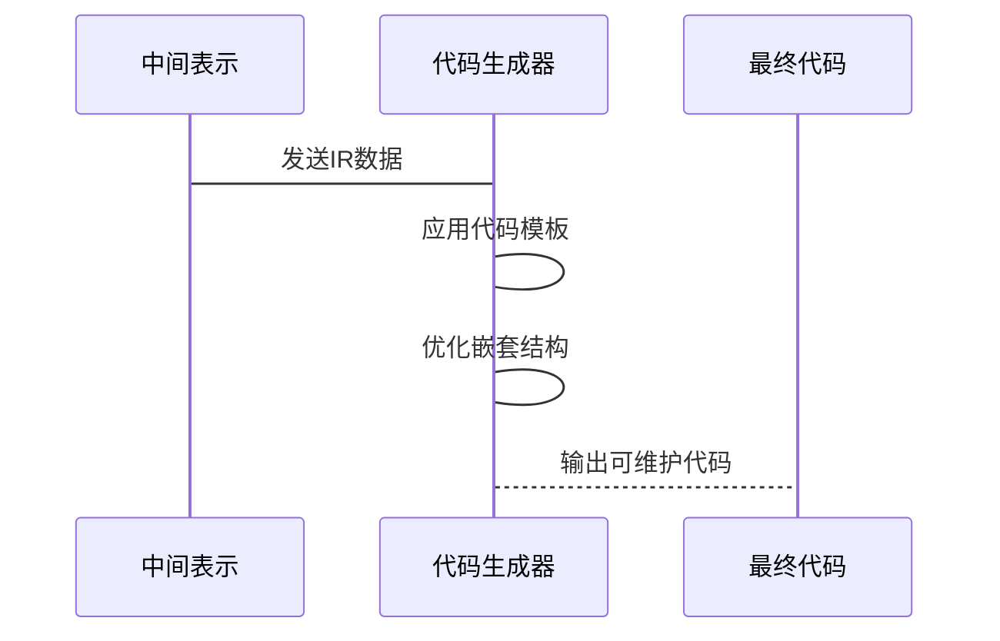
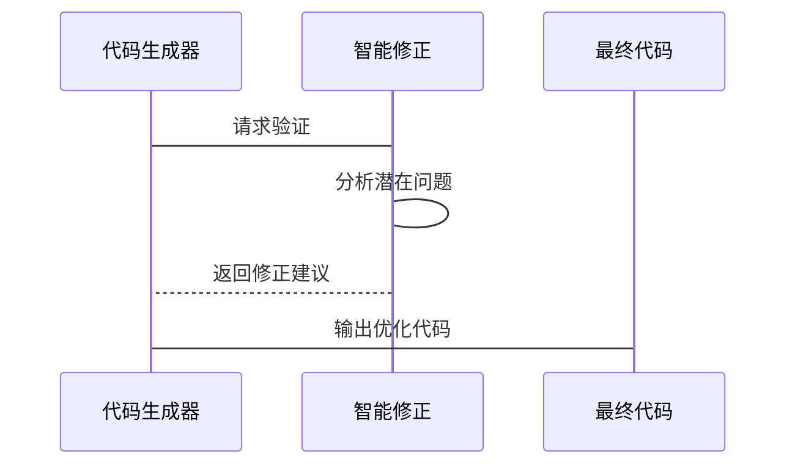

# 核心问题分析
本质是建立设计稿(Figma)与代码组件之间的【结构化映射关系】。

第一步：找到映射关系。
第二步：【更加智能的抽象、封装、代码设计】。
> 初期可能使用 absolute 实现布局，但此时对程序原而言并非可用。
> 后期：使用 flex 布局，实现组件的自适应。
> 最后：不断抽象、封装公共内容，完全贴近程序原编码。

关键挑战：
* 设计元素到代码组件的智能识别与映射
* 布局关系的准确解析
* 组件属性的精确提取
* 代码生成的质量与可维护性【后期实现】


# 整体设计

> 该问题的关键是 【Figma】的基建，当下其已经实现了对【前端元素】的【描述】。

## 核心处理流程


## 组件识别流程


## 代码生成


## 异常处理


# 数据结构

## Figma
```typescript
interface DesignNode {
  id: string; // Figma节点ID
  type: string; // 节点类型(frame, rectangle, text等)
  name: string; // 节点名称
  properties: {
    size: { width: number; height: number };
    position: { x: number; y: number };
    style: StyleProperties;
    // 其他Figma属性
  };
  children: DesignNode[];
  metadata: {
    componentType?: string; // 识别的组件类型(Button, Card等)
    variant?: string; // 组件变体
    relationships: {
      parent: string | null;
      siblings: string[];
    };
  };
}

interface StyleProperties {
  fills?: Paint[];
  strokes?: Paint[];
  effects?: Effect[];
  textStyle?: TextStyle;
}
```

## 组件映射关系
```
interface ComponentMapping {
  figmaType: string; // Figma原始类型
  figmaNamePattern?: RegExp; // 用于匹配组件名称的正则
  codeComponent: string; // 对应代码组件名称
  propertyMap: {
    [figmaProperty: string]: {
      codeProperty: string;
      transform?: (value: any) => any; // 值转换函数
    };
  };
  layoutStrategy: 'flex' | 'grid' | 'absolute' | 'stack'; // 布局策略
  childrenHandling: 'wrap' | 'direct' | 'ignore'; // 子节点处理方式
}
```


# 项目计划

## 第一阶段MVP (4-6周)

> 初期可多个方向都试一下实现。比如 absolute 布局、flex 布局。

基础组件识别与转换(按钮、文本、输入框等)

简单布局实现(flex-based)

基础代码生成(React)

手动组件映射配置

## 第二阶段MVP (8-12周)

复合组件识别(卡片、列表等)

高级布局分析(grid/stack)

代码优化与重构能力

自动组件识别改进

多框架支持(Vue等)

## 第三阶段 (后续迭代)

特殊组件处理(Popover等)

设计系统集成

智能修正建议

变更检测与增量更新

## 第四阶段（完善）

> 循环验证。

| 项目里程碑 | 目标 | 评估指标 |
|------------|------|----------|
|M1|基础组件准确率>85%|组件识别准确率、属性转换完整度|
|M2|布局准确率>80%|布局还原度、代码合理性|
|M3|代码可维护性达标|代码评审通过率、手动调整时间|
|M4|全流程自动化|端到端转换成功率|

# 收益

## 效率提升

* 减少70%+基础UI编码时间

* 快速响应设计变更

* 沟通效率

* 设计-开发交接时间减少50%

* 减少设计还原度沟通

## 质量提升

* 一致性

* 设计实现一致性>95%

* 减少样式冲突

* 结构化代码更易于维护

* 自动生成的类型定义提高可靠性（AI检测）
