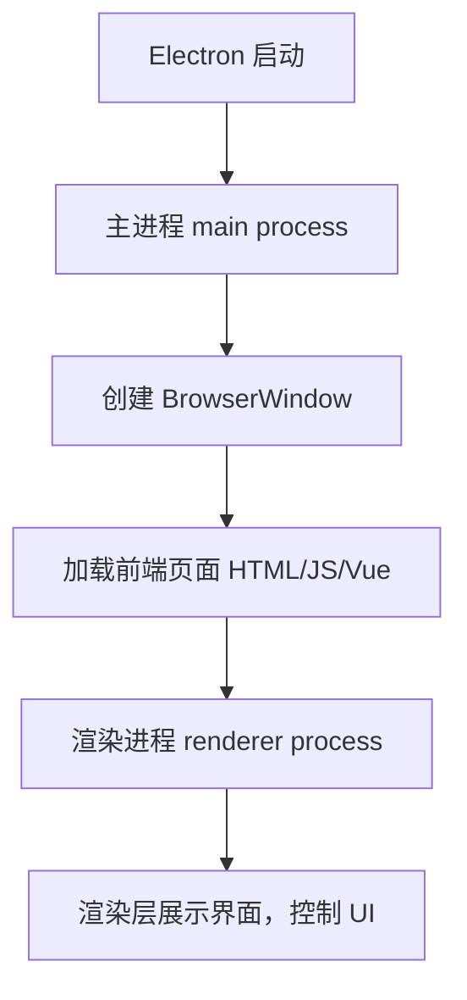
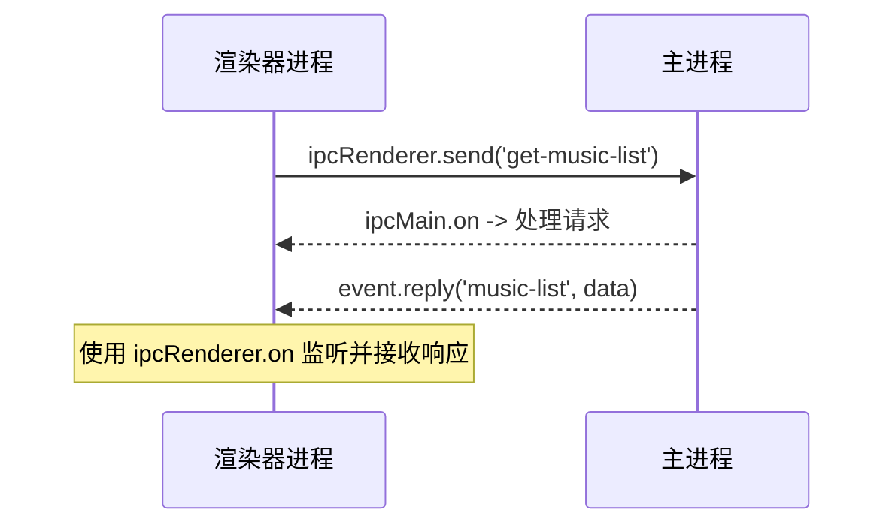
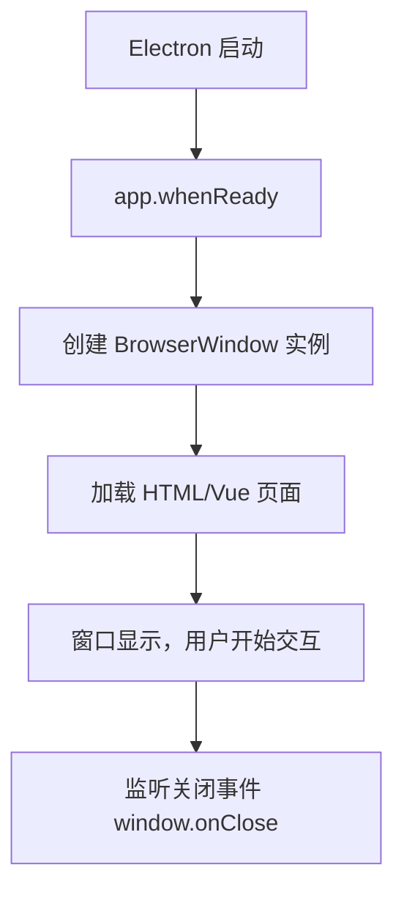
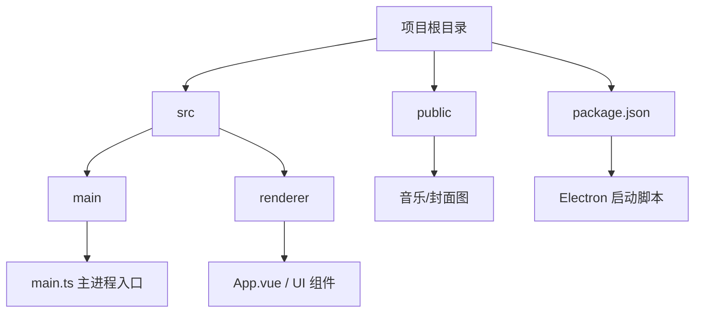
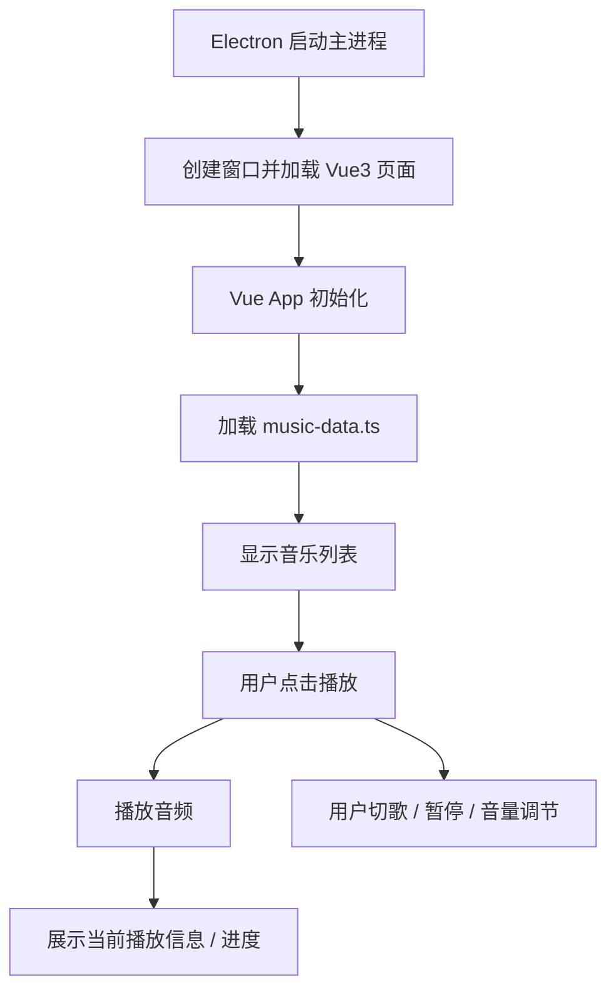
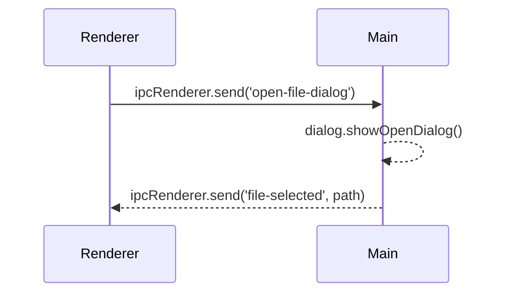

# Electron 整体运行原理

补充说明

- 主进程：控制整个应用生命周期
- 渲染进程：加载 html/css/js （或者是 Vue 应用），控制界面交互
- 每个窗口=一个渲染进程

# electron 主进程与渲染进程通信机制

# BrowserWindow 生命周期流程

- app.whenReady 是创建窗口的最佳时机
- window.on('closed') 用来销毁窗口引用，防止内存泄漏

# Electron 项目目录推荐

# 播放器运行流程

# 导入本地音乐

