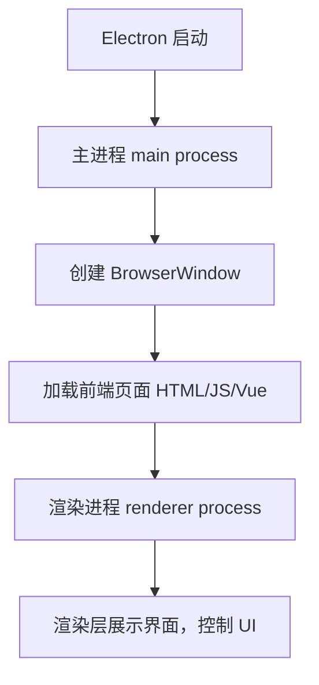
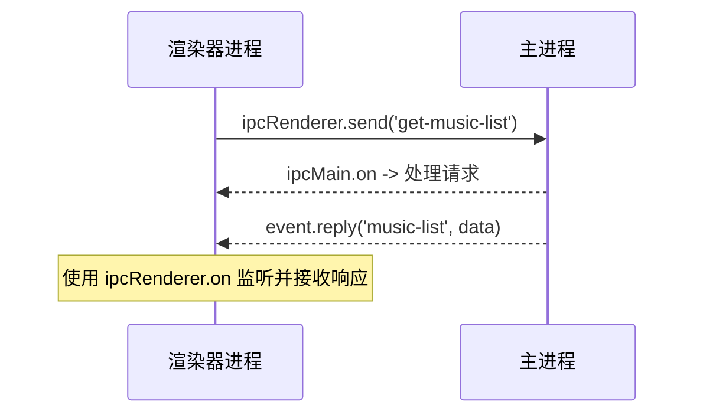
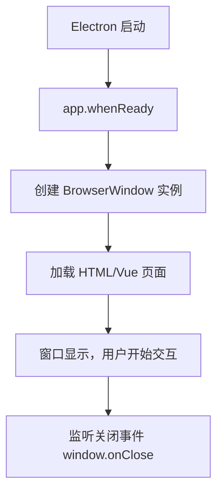
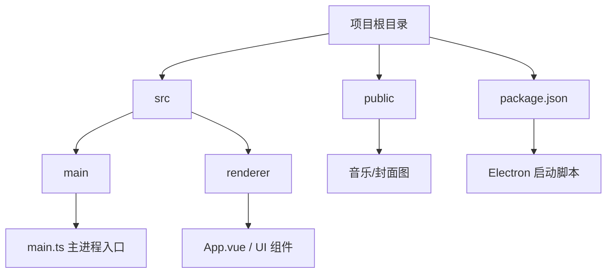
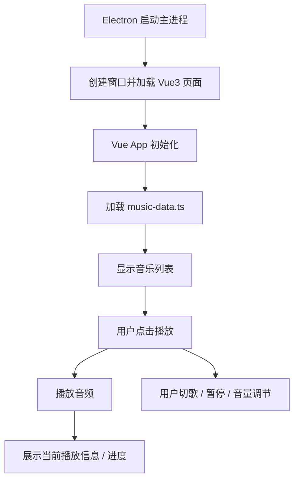
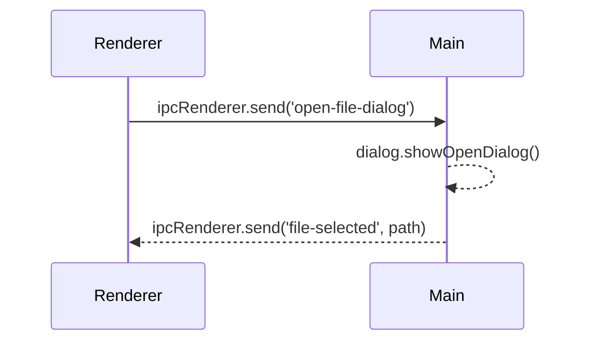

# Electron 整体运行原理



补充说明

- 主进程：控制整个应用生命周期
- 渲染进程：加载 html/css/js （或者是 Vue 应用），控制界面交互
- 每个窗口=一个渲染进程

# electron 主进程与渲染进程通信机制



# BrowserWindow 生命周期流程



- app.whenReady 是创建窗口的最佳时机
- window.on('closed') 用来销毁窗口引用，防止内存泄漏

# Electron 项目目录推荐



# 播放器运行流程



# 导入本地音乐



# 打包应用

electron 核心模块没有捆绑任何打包内容。
依赖于 `electron forge` 来完成打包。

安装依赖 + 启动配置命令
```
npm install --save-dev @electron-forge/cli
npx electron-forge import
```
执行 make
* 1.将应用与 electron 二进制包结合。完成打包的代码，会被生成到一个特定的文件夹内。
* 2.使用这个文件夹，为每个 maker，配置一个可分发文件

```shell
npm run make

> blackMyth@1.0.0 make
> electron-forge make

✔ Checking your system
✔ Loading configuration
✔ Resolving make targets
  › Making for the following targets:
✔ Running package command
  ✔ Preparing to package application
  ✔ Running packaging hooks
    ✔ Running generateAssets hook
    ✔ Running prePackage hook
  ✔ Packaging application
    ✔ Packaging for arm64 on darwin [2s]
  ✔ Running postPackage hook
✔ Running preMake hook
✔ Making distributables
  ✔ Making a zip distributable for darwin/arm64 [7s]
✔ Running postMake hook
  › Artifacts available at: /Users/chp/code/blackMyth/out/make

(node:62436) [DEP0174] DeprecationWarning: Calling promisify on a function that returns a Promise is likely a mistake.
(Use `node --trace-deprecation ...` to show where the warning was created)
(node:62436) [DEP0174] DeprecationWarning: Calling promisify on a function that returns a Promise is likely a mistake.
(node:62436) [DEP0174] DeprecationWarning: Calling promisify on a function that returns a Promise is likely a mistake.
(node:62436) [DEP0174] DeprecationWarning: Calling promisify on a function that returns a Promise is likely a mistake.
(node:62436) [DEP0174] DeprecationWarning: Calling promisify on a function that returns a Promise is likely a mistake.
(node:62436) [DEP0174] DeprecationWarning: Calling promisify on a function that returns a Promise is likely a mistake.
(node:62436) [DEP0174] DeprecationWarning: Calling promisify on a function that returns a Promise is likely a mistake.
(node:62436) [DEP0174] DeprecationWarning: Calling promisify on a function that returns a Promise is likely a mistake.
(node:62436) [DEP0174] DeprecationWarning: Calling promisify on a function that returns a Promise is likely a mistake.
(node:62436) [DEP0174] DeprecationWarning: Calling promisify on a function that returns a Promise is likely a mistake.
(node:62436) [DEP0174] DeprecationWarning: Calling promisify on a function that returns a Promise is likely a mistake.
(node:62436) [DEP0174] DeprecationWarning: Calling promisify on a function that returns a Promise is likely a mistake.
(node:62436) [DEP0174] DeprecationWarning: Calling promisify on a function that returns a Promise is likely a mistake
```

打包成功后，`out/make` 里面的文件就可以启动了。

# 发布应用
> 重要提示：对代码进行签名。

为了将应用发给最终用户，我们强烈您对 Electron 进行签名。

macOS中，代码签名在【程序打包时候】完成。

如何发布到 github 中，并且进行 release 打包。

# Problem

## 1.什么是预加载脚本
Electron 的主进程，拥有完全【操作系统】访问的权限。
出于安全原因，渲染进程跑在网页上，而非是 Node 里。
为了将不同类型的进程桥接在一起，我们需要使用 预加载的 特殊脚本。

所以，预加载脚本，是一个桥梁？？？


## 2.electron是如何发布的(如何打包应用)


## 3.electron如何结合 vue3 进行开发
打包过程示意图

【开发环境】
1.启用 vite 开发服务器
2.加载 vue3 插件，处理 `.vue` 文件
3.利用 ES 模块，直给浏览器
4.支持热模块替换，提高开发效率

【生产环境】
1.使用 Rollup 打包
2.优化代码（tree-shaking、压缩）
3.生成静态资源

### 结合 Electron 特殊的地方。
1.主进程直接运行 Node，不经过 Vite 处理
2.渲染进程经过 Vue3 编译后，通过 mainWindow.loadURL 加载到 Electron 窗口
3.生产环境，Vite 打包结果通过 mainWindow.loadFile()加载。

```javascript
// 1️⃣ 单向IPC：渲染进程发命令，主进程执行
ipcMain.on('window-minimize', (e) => win.minimize())

// 2️⃣ 双向IPC：渲染进程问状态，主进程回答
ipcMain.handle('window-is-maximized', (e) => win.isMaximized())

// 3️⃣ 主进程主动通知：窗口变化时主动告诉渲染进程
win.on('maximize', () => win.webContents.send('window-maximize-change', true))
```

## 🧩 记忆口诀
- on ：单向命令（"做这件事"）
- handle ：双向问答（"现在是什么状态？"）
- send ：主进程主动通知（"告诉你个消息"）
就是这么简单！3种通信对应3种不同的使用场景
