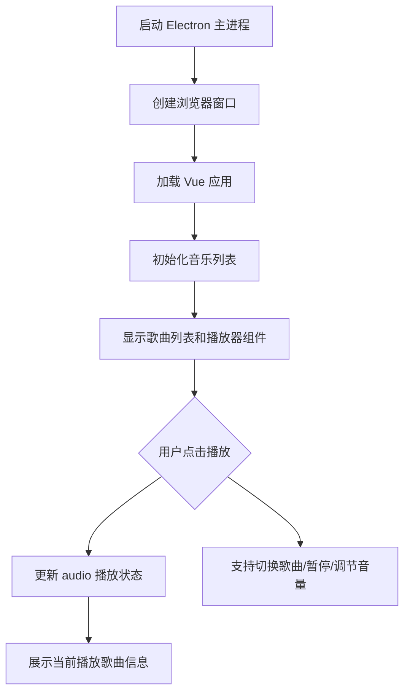

# 黑神话播放器 - BlackMyth Player 🎵

一个基于 Vue 3 + Electron + JS 构建的简易桌面音乐播放器，只播放黑神话·悟空的原声音乐。**3 晚开发内可完成。**

## ✨ 功能特性

- 播放黑神话音乐（本地音频）
- 简洁 UI，展示歌曲列表、封面、播放控制栏
- 支持播放、暂停、切换、音量调节

## 🧱 技术栈/工程化

- Electron（构建桌面应用）
- vue 3 + JS（构建前端 UI）
- Vite（快速构建工具）
- HTML5 `<audio>` API（实现音频播放）
- less
- lefthook

## 📦 快速开始

### 1. 克隆项目并安装依赖

```bash
pnpm install
```

### 2.开发模式启动

```
pnpm dev
```

### 3.构建打包

```
pnpm build
```

构建后可在 `dist/` 下获取可运行的桌面程序

### 4.项目结构

## 项目流程图


