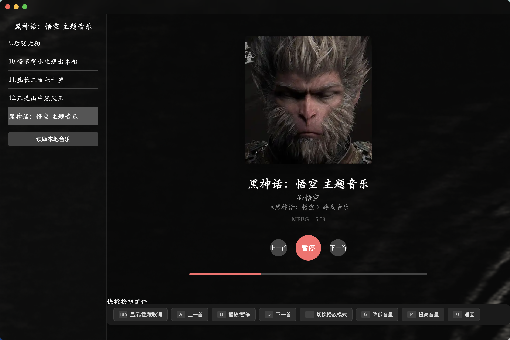
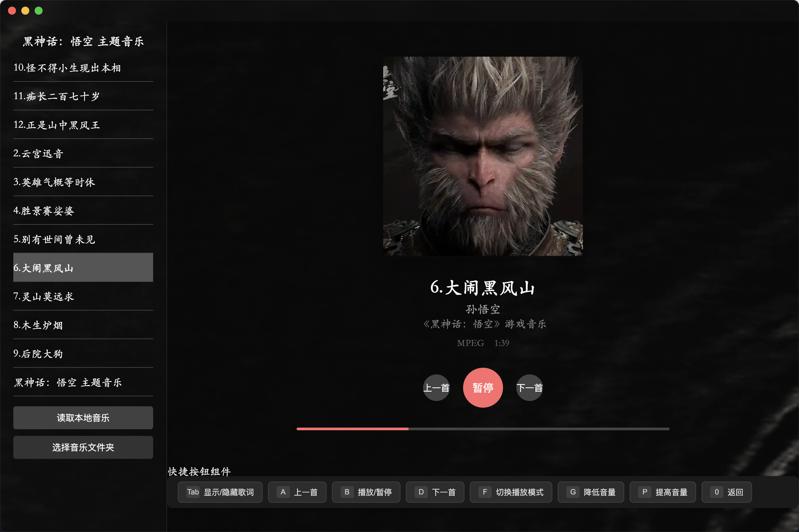
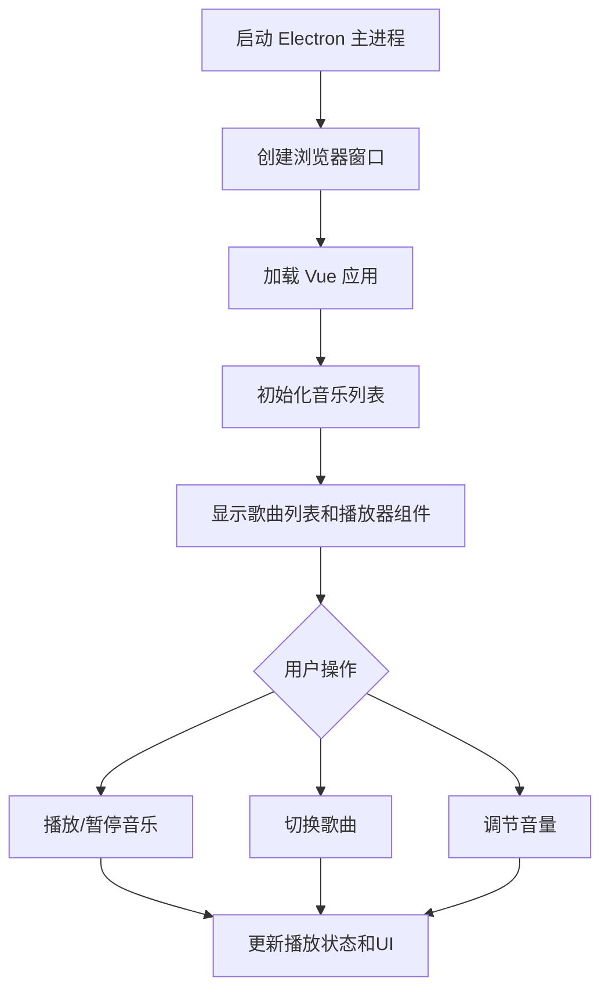

# 黑神话播放器 - BlackMyth Player 🎵
一个基于 Vue 3 + Electron 构建的桌面音乐播放器，专注于播放黑神话·悟空的原声音乐。设计简洁，功能专注，让你沉浸式体验游戏原声。

## 第一版本




## ✨ 核心功能
- 🎶 本地音乐播放：支持播放黑神话·悟空原声音乐
- 🎵 歌曲列表管理：左侧列表展示所有可用歌曲
- 🎼 专辑封面展示：大尺寸专辑封面，视觉效果出众
- ▶️ 播放控制：支持播放、暂停、上一首、下一首
- 🔊 音量调节：便捷控制播放音量
- 🎨 简洁UI：深色主题设计，专注音乐体验
## 🛠️ 技术栈
- 前端框架 ：Vue 3 Composition API
- 桌面应用 ：Electron
- 构建工具 ：Vite
- 音频处理 ：HTML5 Audio API
- 样式处理 ：Less
- 代码规范 ：ESLint, Lefthook
- 包管理 ：npm

## 🚀 快速开始
### 1. 安装依赖

```
npm install
```

2. 开发模式启动

```
npm run dev
```

### 3. 项目结构
```
blackMyth/
├── build/              # 构建配置
│   ├── vite.main.config.mjs     # 主进程配置
│   ├── vite.preload.config.mjs  # 预加载脚本配置
│   └── vite.renderer.config.mjs # 渲染进程配置
├── doc/                # 文档和资源
├── public/             # 公共资源
├── src/
│   ├── components/     # Vue 组件
│   │   ├── LeftList.vue     # 歌曲列表
│   │   ├── MusicPlayer.vue  # 音乐播放器
│   │   └── MacTitleBar.vue  # 标题栏
│   ├── composables/    # 组合式函数
│   │   ├── useMusicStore.js # 音乐状态管理
│   │   └── useElectron.js   # Electron 交互
│   ├── icons/          # 图标资源
│   ├── style/          # 样式文件
│   ├── App.vue         # 主应用组件
│   └── main.js         # 入口文件
├── package.json        # 项目依赖
└── README.md           # 项目文档
```


🔄 项目流程


本项目设计为简洁的音乐播放器，专注于黑神话·悟空原声音乐的播放体验。项目采用 Vue 3 的 Composition API 结合 Electron 构建跨平台桌面应用，使用 Vite 提供快速的开发体验。

音乐播放功能通过 HTML5 Audio API 实现，状态管理使用了简单的组合式函数模式，确保代码简洁且易于维护。

## 💡 提示
- 确保你的系统已安装 Node.js 和 npm
- 开发过程中遇到问题可查看 doc/problem.md 的解决方案
- 如需自定义构建配置，可修改 build/ 目录下的 Vite 配置文件
